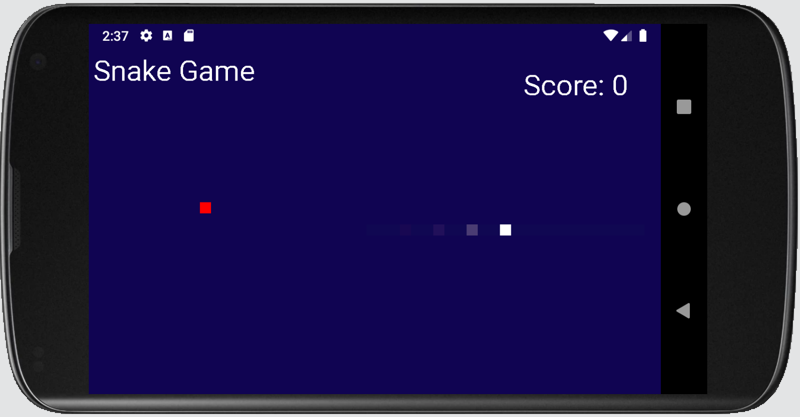
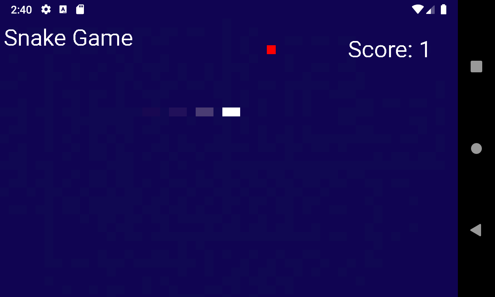
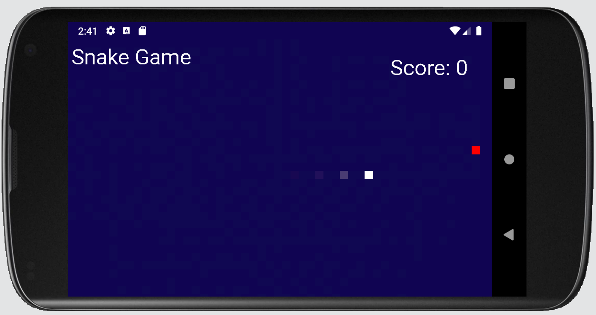

# CS441 SNAKE GAME ANDROID APP

## Functionality

The snake game app implements the SurfaceView class. It requires the user to control a 'snake', represented by a line of ombre white boxes, on a mission to capture a red dot on the screen. The user does not use their up/down/left/right keys but rather their mouse to click on different parts of the screen, controlled by the onTouchEvent() method in the SurfaceView SnakeEngine class. Both the target and snake were created using paint and canvas. To differentiate between the snake moving up/down/left/right, switch and case statements were used. My idea for this project came from my love of the snake game from when I was a child! I was always interested in making my own version one day. Though mine is very basic, and has a few things that can be improved, it was still fun to create. A few tutorials on the web helped me a great deal to start coding as I never made a game in Android Studio and it was quite different than past code completed using the software.

## Preview

